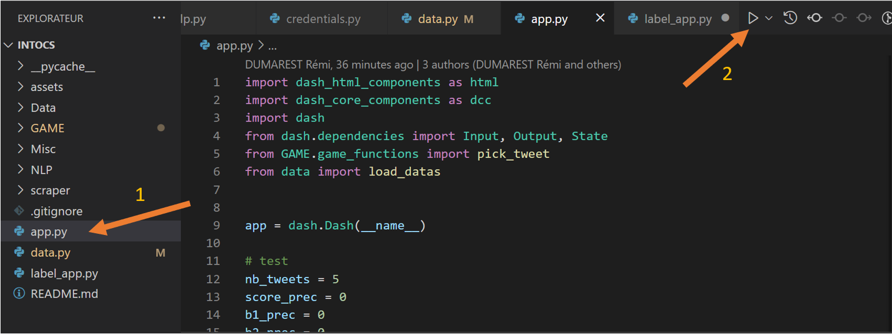
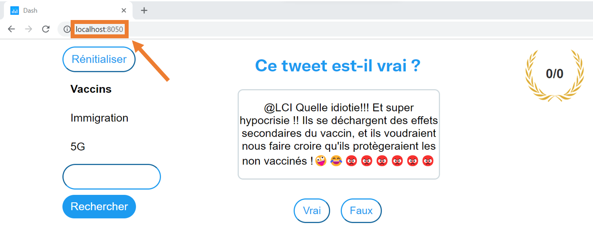

# IntoCS

IntoCS est un jeu pédagogique visant à montrer qu'une information trouvée sur internet n'est pas toujours vraie.  
Le principe est simple, après avoir choisit une catégorie, le joueur reçoit une liste de tweets et doit dire s'ils sont vrais ou faux.

## L'équipe IntoCS

- Rémi GODET
- Valentin GERARD
- Louise SIMOULIN
- Quentin PAYET
- Rémi DUMAREST

## Installation

Utilisez le package manager [pip](https://pip.pypa.io/en/stable/) pour installer les différentes librairies utilisées par IntoCS

```bash
pip install pandas dash dash_core_components dash_html_components tkinter tweepy tensorflow nltk sklearn keras tweepy
```
## twitter scraper credentials

Trouvez le fichier credentials_example.py dans intocs/scraper
Dupliquez-le sous le nom credentials.py et remplissez les quatre informations confidentielles manquantes.

## AI training
Commencez par établir une database labelée en lancant plusieurs fois le fichier label_app.py avec des valeurs différentes (qui sont demandées en interface console) et en utilisant ensuite l'interface Tkinter.

Puis, se rendre sur le fichier NLP/lstm.py, modifier les valeurs des hyperparamètres et exécuter le fichier.
Le résultat du modèle apparait sous la forme d'une matrice de confusion seaborn et de messages console.
Relancer en affinant les hyperparamètres si nécessaire.

## Démarrage

Clonez le dépot gitlab sur votre PC, ouvrez le fichier app.py et exécutez le.  
Aller ensuite sur votre navigateur préféré à l'adresse localhost:8050.  





## Couverture de tweets

Pour générer le rapport de couverture de test lancer la commande pytest 

```python 
--cov-report html --cov tests/
```
